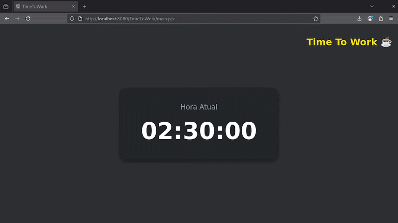

# TimeToWork Relógio JSP

Projeto **TimeToWork** é um relógio em tempo real feito com **JSP, Servlet Java e JavaScript**.  
Ele exibe a hora atual no estilo escuro tipo Discord, com atualização automática a cada segundo.

## Exemplo Visual

Abaixo está um exemplo de como o relógio aparece em tempo real:

## Explicação do Código

### 1. HoraServlet.java
O arquivo `HoraServlet.java` está localizado em `TimeToWork/WEB-INF/classes/HoraServlet.java` e é responsável por fornecer a **hora atual do servidor**.

### Imports Utilizados

- `import java.io.IOException;`  
  → Tratamento de exceções de entrada/saída no servlet.

- `import java.text.SimpleDateFormat;`  
  → Formatação da data e hora em um padrão específico.

- `import java.util.Date;`  
  → Representa a data e hora atual do sistema.

- `import java.util.Locale;`  
  → Define a localidade (pt-BR) para formatar corretamente a hora.

- `import javax.servlet.ServletException;`  
  → Tratamento de exceções específicas de servlets.

- `import javax.servlet.http.HttpServlet;`  
  → Classe base para criar servlets HTTP.

- `import javax.servlet.http.HttpServletRequest;`  
  → Permite acessar dados da requisição HTTP enviada pelo cliente.

- `import javax.servlet.http.HttpServletResponse;`  
  → Permite enviar dados de volta ao cliente via resposta HTTP.

  ### Estrutura do Servlet

- `public class HoraServlet extends HttpServlet {}`  
  → Cria um servlet. O `extends HttpServlet` significa que a classe pode **responder a requisições HTTP**.

- `protected void doGet(HttpServletRequest request, HttpServletResponse response)`  
  → `protected` é um **modificador de acesso**, ou seja, o método pode ser usado pela própria classe e por subclasses.  
  → `void` indica que o método **não retorna valor direto**.  
  → `doGet` é o **nome do método**, que responde a requisições GET enviadas pelo cliente.  
  → `HttpServletRequest request` representa a **requisição enviada pelo cliente**.  
  → `HttpServletResponse response` representa a **resposta que será enviada ao cliente**.

- `throws ServletException, IOException`  
  → Esse método pode gerar erros.  
  → `ServletException` trata **erros relacionados ao servlet**.  
  → `IOException` trata **erros de entrada/saída**.

- `response.setContentType("text/plain");`  
  → Informa ao navegador que **o conteúdo enviado será texto simples**.

- `SimpleDateFormat formato = new SimpleDateFormat("HH:mm:ss", new Locale("pt", "BR"));`  
  → `SimpleDateFormat` transforma datas em texto formatado.  
  → `"HH:mm:ss"` define o **formato da hora** (horas:minutos:segundos).  
  → `new Locale("pt", "BR")` define **idioma e região** (Português, Brasil).

- `String hora = formato.format(new Date());`  
  → Guarda o resultado em uma **variável do tipo texto (`String`)** chamada `hora`.  
  → `formato.format(...)` pega o objeto `Date` e o converte no **formato HH:mm:ss**.  
  → `new Date()` cria um objeto de **data/hora atual do sistema**.

- `response.getWriter().write(hora);`  
  → `getWriter()` retorna um objeto que permite **escrever texto na resposta HTTP**.  
  → `write(hora)` escreve o **conteúdo da variável `hora`** que será enviado para o navegador.